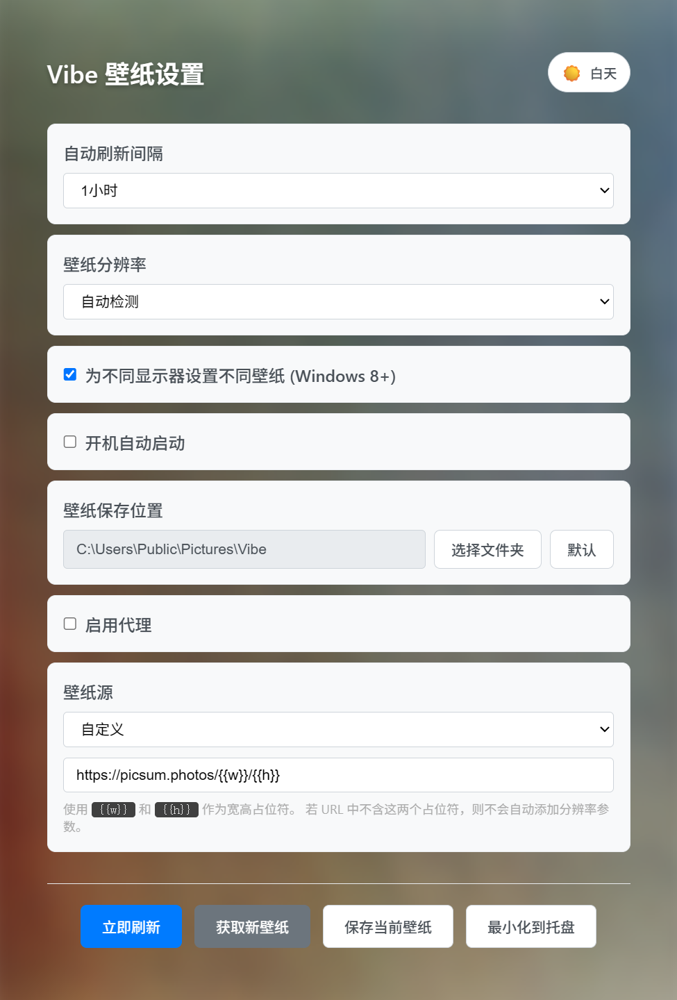

# Vibe Wallpaper

一个 Windows 桌面壁纸自动更换工具，基于 **Tauri 2.0 + Vue 3 + TypeScript** 构建。
支持定时刷新、多显示器分别设置、壁纸预览挑选、系统托盘与开机自启动。

官网：<https://vibe-wallpaper.bodil.cn> ｜ 源码仓库：<https://github.com/Bodil-X/vibe-wallpaper>

## 界面预览

设置窗口——刷新间隔、分辨率、多显示器、自启动、保存位置、代理与壁纸源均可配置：



预览窗口——批量获取候选壁纸，逐张浏览后设置为壁纸或保存到本地：


## 功能

- **定时自动刷新**：5 分钟 ~ 1 天多档间隔可选，后台自动下载并更换壁纸
- **壁纸预览挑选**：一次获取 5 张候选图，在独立的预览窗口中逐张浏览，可指定设置到某块显示器或保存到本地
- **多显示器支持**：可为不同显示器设置不同壁纸（Windows 8+）
- **分辨率选择**：自动检测屏幕分辨率，或手动指定 1080p / 2K / 4K / 5K
- **可配置壁纸源**：默认使用 Unsplash 随机图源，也支持自定义 URL 模板（`{{w}}`、`{{h}}` 宽高占位符）
- **壁纸保存**：一键将当前壁纸保存到本地文件夹（默认 `~/Pictures/Vibe`）
- **系统托盘**：刷新壁纸 / 设置 / 退出菜单，左键托盘图标显示主窗口，可最小化驻留后台
- **开机自启动**：通过注册表 `HKCU\...\Run` 实现，可在设置中开关
- **明暗主题**：跟随系统 / 浅色 / 深色

## 运行环境

- Windows 10 / 11（仅支持 Windows，壁纸设置使用 Win32 API）
- [WebView2 运行时](https://developer.microsoft.com/microsoft-edge/webview2/)（Windows 11 已内置）
- [Node.js](https://nodejs.org/) + [pnpm](https://pnpm.io/)
- [Rust](https://www.rust-lang.org/)（含 MSVC 构建工具）

## 开发

```bash
pnpm install      # 安装前端依赖
pnpm tauri dev    # 启动完整应用（Rust 后端 + Vite 开发服务器）
```

仅运行前端开发服务器（不含 Tauri 能力）：

```bash
pnpm dev          # http://localhost:1420
```

## 构建

```bash
pnpm tauri build  # 类型检查 + 前端构建 + Rust 打包
```

产物位于 `src-tauri/target/release/`（安装包在 `bundle/` 下）。

其他脚本：

```bash
pnpm build        # 仅执行 vue-tsc 类型检查和 Vite 构建
pnpm preview      # 预览构建后的前端
```

## 配置文件

应用配置保存在 `%LOCALAPPDATA%\vibe-wallpaper\config.json`，主要字段：

| 字段 | 说明 |
| --- | --- |
| `refresh_interval` | 刷新间隔，如 `5min`、`1hour`、`1day` |
| `resolution` | `auto` 或 `宽x高`，如 `1920x1080` |
| `different_per_monitor` | 是否为每块显示器设置不同壁纸 |
| `auto_start` | 是否开机自启动 |
| `save_location` | 壁纸保存目录 |
| `source_type` | `unsplash` 或 `custom` |
| `source_url` | 图源 URL 模板，默认 `https://source.unsplash.com/random/{{w}}x{{h}}` |
| `theme` | `system` / `light` / `dark` |

下载的临时图片缓存于 `%TEMP%\vibe_wallpaper`。

## 技术栈

- **后端**：Rust + Tauri 2.0（`ureq` 同步 HTTP、`winapi`/`windows`/`winreg` 调用系统 API）
- **前端**：Vue 3（Composition API + `<script setup>`）+ TypeScript + Vite 6
- **包管理**：pnpm

## 已知限制

- 仅支持 Windows。
- 设置界面中的代理选项目前**尚未实际生效**：代理地址/账号会被保存，但下载请求暂未走代理。
- 无自动化测试与 Lint 配置。

## License

[MIT](LICENSE) © Bodil
